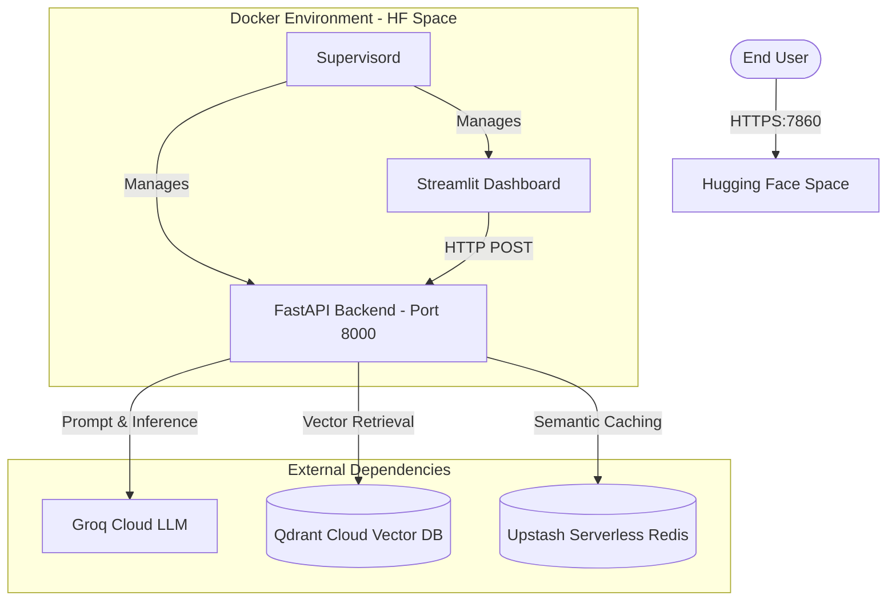

# Architecture & Deployment Structure

## System Overview

Agentic RAG Engine is a production-grade Retrieval-Augmented Generation
pipeline. It processes PDF documents, stores them in a vector database, and
answers natural language questions with source citations, autonomous routing, and hallucination detection.

## Hosting & Deployment Environment

This project is deployed using a containerized microservices approach, currently hosted on **Hugging Face Spaces**.

*   **Application Host**: Hugging Face Spaces (Docker SDK). Custom `Dockerfile` utilizes `supervisord` to run both the Streamlit frontend and the FastAPI backend within a single container.
*   **Web Interface (Port 7860)**: Streamlit powers the `dashboard/app.py`, which is exposed publicly by Hugging Face Spaces.
*   **Backend API (Port 8000)**: FastAPI runs internally on the loopback (`0.0.0.0:8000`) and serves retrieval/query execution requests locally to the Streamlit UI. It is isolated from public internet access for security.
*   **LLM Engine**: Groq Cloud (`llama-3.3-70b-versatile`), offering immense LPU processing speeds (~800 tok/s) that makes 3-stage agentic RAG calls fluid.
*   **Vector Storage**: External Qdrant Cloud Cluster. Stores the dense chunks. The backend strips `https://` from Hugging Face secrets natively to interact with the underlying gRPC/REST APIs safely.
*   **Semantic Cache**: Upstash Serverless Redis. Caches embeddings and semantic responses. The backend uses a sanitized `REDIS_HOST` URL connection.

## Infrastructure Diagram

## Data Flow Pipeline

1. **Ingestion**: 
   * PDF parsed via `pymupdf4llm`.
   * Adaptive Chunker strategy applied (Chunk length: 512, overlap 102). 
   * Strict deterministic `MD5(doc_id + strategy + index)` hashing ensures chunks do not duplicate across evaluation benchmarks.
   * Uploaded to Qdrant alongside BM25 sparse indexes.

2. **Querying**:
   * Correlation ID assigned for latency tracing.
   * Redis cache queried.
   * `QueryRouter` Agent passes input to Groq: classifies into SIMPLE, ANALYTICAL, COMPARATIVE, MULTI_HOP, or OUT_OF_SCOPE.
   * **Security Guardrail**: ANY prompt injection attempt triggers an OUT_OF_SCOPE routing path, which gracefully shortcuts the entire pipeline and returns a standardized UI rejection, denying system exploitation.
   * Based on classification, pipeline runs Hybrid Search (RRF) and sends candidates to the Cross-Encoder (`ms-marco`) re-ranker.
   * Groq generates Cited Answers based strictly on returned chunk contexts.
   * `HallucinationDetector` Agent audits the result against source context before allowing UI propagation. Outputs are auto-recorded to JSON for UI reporting.
