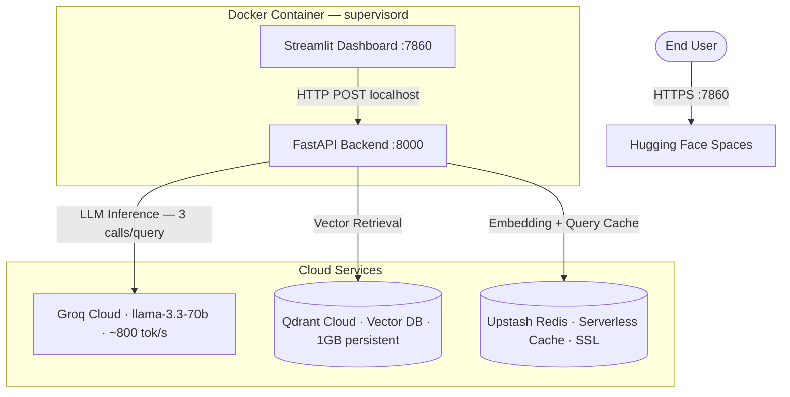
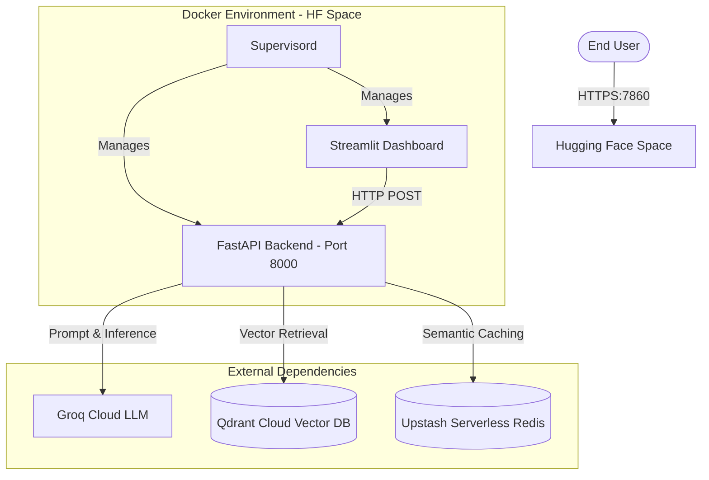

---
# Agentic RAG Engine

> A production-grade Retrieval-Augmented Generation pipeline that doesn't just answer questions — it explains **why** it answered the way it did, **where** the information came from, and **how confident** it is.

[](https://huggingface.co/spaces/ashrithr07/agentic-rag-engine)
[](https://ashrithr07-agentic-rag-engine.hf.space/docs)
[](https://hub.docker.com/r/ashrithr07/agentic-rag-engine)
[](https://www.python.org/)
[](tests/)
[](LICENSE)
---
## Table of Contents

- [Problem Statement](#-problem-statement)
- [Live Demo](#-live-demo)
- [Architecture Overview](#-architecture-overview)
- [Tech Stack](#-tech-stack)
- [Features](#-features)
- [How It Works](#-how-it-works)
- [Setup Instructions](#-setup-instructions)
- [Environment Variables](#-environment-variables)
- [API Documentation](#-api-documentation)
- [Dashboard](#-dashboard)
- [Evaluation & Benchmarks](#-evaluation--benchmarks)
- [Folder Structure](#-folder-structure)
- [Deployment Guide](#-deployment-guide)
- [Key Design Decisions](#-key-design-decisions)
- [Contributing](#-contributing)
- [License](#-license)

---

## 🧠 Problem Statement

Standard RAG implementations suffer from three recurring failure modes that make them unsuitable for production:

1. **Retrieval quality degrades on complex queries.** Single-strategy dense retrieval misses passages that exact keyword search would find. Most toy implementations use FAISS + a for-loop — no fusion, no re-ranking, no diversity enforcement.
2. **LLMs hallucinate without detection.** Generated answers can be plausible and fluent while being entirely ungrounded in the retrieved context. Without a verification layer, errors propagate silently to the user.
3. **Agentic pipelines are prompt injection targets.** Systems that route queries through an LLM before retrieval can be hijacked via adversarial prompts — wasting compute or leaking system behaviour.

This project addresses all three failure modes: hybrid retrieval with RRF fusion and cross-encoder re-ranking eliminates the first, a hardened query router that fails closed on adversarial input eliminates the third, and an independent hallucination auditor that verifies every generated answer against its source passages before delivery eliminates the second.

---

## 🚀 Live Demo


| Resource                 | URL                                                                                                                |
| ------------------------ | ------------------------------------------------------------------------------------------------------------------ |
| 📊 Interactive Dashboard | [huggingface.co/spaces/ashrithr07/agentic-rag-engine](https://huggingface.co/spaces/ashrithr07/agentic-rag-engine) |
| 📡 API Documentation     | [ashrithr07-agentic-rag-engine.hf.space/docs](https://ashrithr07-agentic-rag-engine.hf.space/docs)                 |
| ❤️ Health Endpoint     | [ashrithr07-agentic-rag-engine.hf.space/health](https://ashrithr07-agentic-rag-engine.hf.space/health)             |

Upload any PDF, query it in natural language, and inspect retrieval scores, per-stage latency waterfall charts, token costs, and hallucination audit results — all from the browser.

---

## 🏗️ Architecture Overview

The system runs as two co-located processes inside a single Docker container managed by `supervisord`. The Streamlit dashboard (port `7860`) communicates exclusively with the FastAPI backend (port `8000`) over the container loopback — the backend is never exposed to the public internet.



**Key architectural decisions:**

- **`supervisord`** runs both services in one container, keeping inter-service communication on loopback with zero network overhead and no public backend exposure.
- **Groq LPU inference** (~800 tokens/second) makes three sequential LLM calls per query (routing → generation → hallucination audit) take ~600ms instead of ~3s on standard API providers.
- **Qdrant Cloud** maintains two separate collections (`bge_chunks` 768-dim, `minilm_chunks` 384-dim) to support dual-embedding hybrid retrieval.
- **Upstash Serverless Redis** provides embedding caching (TTL: 24h) and query result caching (TTL: 1h) without requiring a persistent server instance.
- **HF Spaces** was chosen over a self-managed VM for its purpose-built ML demo environment (16GB RAM, 2 vCPUs, free tier) with a URL format that recruiters recognise.

---

## ⚙️ Tech Stack


| Layer                   | Tool                                   | Notes                                       |
| ----------------------- | -------------------------------------- | ------------------------------------------- |
| **Language**            | Python 3.13                            | `>=3.11` compliant                          |
| **LLM**                 | Groq`llama-3.3-70b-versatile`          | ~800 tok/s, 128k context, JSON mode         |
| **LLM SDK**             | `groq>=0.9.0`                          | Async + sync, tenacity 3× retry            |
| **LLM Eval Backend**    | `langchain-groq>=0.1.0`                | RAGAS integration                           |
| **PDF Parsing**         | `pymupdf4llm>=0.0.17`                  | Markdown-preserving, table-aware            |
| **Chunking**            | Custom classes                         | 4 strategies + AdaptiveChunker              |
| **NLP**                 | spaCy`en_core_web_sm`                  | Sentence segmentation                       |
| **Token Counting**      | `tiktoken` cl100k_base                 | Consistent across pipeline                  |
| **Primary Embedding**   | `BAAI/bge-base-en-v1.5`                | 768-dim, MTEB 63.55, ~45ms/chunk CPU        |
| **Secondary Embedding** | `all-MiniLM-L6-v2`                     | 384-dim, MTEB 56.26, ~12ms/chunk CPU        |
| **Vector DB (local)**   | Qdrant v1.9.2 (Docker)                 | gRPC + REST                                 |
| **Vector DB (cloud)**   | Qdrant Cloud                           | Free 1GB persistent cluster                 |
| **Client Pin**          | `qdrant-client==1.9.2`                 | Must match server version                   |
| **Sparse Retrieval**    | `rank-bm25` (BM25Okapi)                | Persisted index                             |
| **Re-ranker**           | `cross-encoder/ms-marco-MiniLM-L-6-v2` | ~150ms for 20 candidate pairs               |
| **Cache (local)**       | Redis 7.2-alpine (Docker)              |                                             |
| **Cache (cloud)**       | Upstash Redis                          | SSL, free 10k cmds/day                      |
| **Evaluation**          | RAGAS + 6 custom metrics               | 10 total metrics                            |
| **API**                 | FastAPI + uvicorn                      | Fully async throughout                      |
| **UI**                  | Streamlit + Plotly                     | 4 pages                                     |
| **Config**              | Pydantic Settings                      | Single source of truth, cloud-aware         |
| **Logging**             | loguru                                 | Correlation ID in every line                |
| **Retry**               | tenacity                               | 3× exponential backoff (2s → 10s)         |
| **Testing**             | pytest + asyncio + cov                 | 78 tests, 82% coverage                      |
| **Linting / Types**     | ruff + mypy                            | line-length=110                             |
| **Containers (local)**  | Docker Compose                         | 4 services                                  |
| **Containers (cloud)**  | HF Spaces + supervisord                | FastAPI + Streamlit co-located              |
| **Image Registry**      | DockerHub                              | `ashrithr07/agentic-rag-engine`             |
| **Image Arch**          | `linux/amd64`                          | Built via`docker buildx` from Apple Silicon |
| **Process Manager**     | supervisord                            | Multi-process in single HF container        |

---

## ✨ Features

### 1. Agentic Query Routing with Injection Immunity

Every query is classified by a Groq LLM agent (JSON mode) before any retrieval begins. The router returns a structured `query_type` + `reasoning` and derives routing flags that control the entire downstream pipeline:


| Query Type     | Retrieval Strategy        | Re-ranking | Avg Latency |
| -------------- | ------------------------- | ---------- | ----------- |
| `SIMPLE`       | Dense only                | None       | ~250ms      |
| `ANALYTICAL`   | Hybrid RRF                | CE + MMR   | ~1100ms     |
| `COMPARATIVE`  | Hybrid RRF                | CE + MMR   | ~1100ms     |
| `MULTI_HOP`    | Hybrid RRF                | CE + MMR   | ~1200ms     |
| `OUT_OF_SCOPE` | None — immediate refusal | None       | ~180ms      |

`SIMPLE` queries skip hybrid retrieval and re-ranking, saving ~60% latency. Any prompt injection attempt — persona spoofing, system rule overrides, context ignoring — routes to `OUT_OF_SCOPE` and returns an immediate standardised rejection with zero retrieval cost. Router failure defaults to `ANALYTICAL` as a safe fallback.

---

### 2. Two-Stage Hybrid Retrieval with RRF Fusion

Dense and sparse scores operate on incompatible scales (cosine: 0–1, BM25: unbounded). Instead of normalising scores (calibration breaks on corpus changes), the pipeline uses Reciprocal Rank Fusion — rank-based, scale-invariant, and calibration-free:

```
Dense retrieval  → top-20 by cosine similarity (Qdrant, bge-base-en-v1.5)
Sparse retrieval → top-20 by BM25 score (rank_bm25)

RRF score(chunk) = Σ  1 / (k + rank_i)    where k=60 (Cormack & Clarke 2009)

Merged, deduplicated, sorted by RRF score → top-20 candidates forwarded to re-ranker
```

---

### 3. Cross-Encoder Re-ranking + MMR Diversity

Cross-encoders jointly score (query, passage) pairs — far more accurate than bi-encoders, but O(n) with corpus size. The bi-encoder narrows 20 candidates in ~90ms, then the cross-encoder re-ranks those 20 in ~150ms. MMR (λ=0.7) then applies diversity-aware final selection:

```
MMR(chunk) = λ · sim(chunk, query) − (1−λ) · max_sim(chunk, already_selected)
```

Every query also produces an A/B comparison report showing NDCG and MRR before and after re-ranking, with the exact latency overhead measured per request.

---

### 4. Self-Auditing Hallucination Detection

A second Groq call uses adversarial framing — asking the LLM to find claims **not** supported by the retrieved context rather than to generate carefully. This activates verification behaviour that is more reliable than self-critique within a single call:

```json
{
  "supported_claims": ["RRF uses reciprocal ranks from Cormack 2009"],
  "hallucinated_claims": [],
  "unsupported_inferences": [],
  "confidence_score": 0.97,
  "is_reliable": true
}
```

`is_reliable` is `true` when `hallucinated_claims` is empty **and** `confidence_score >= 0.7`. Out-of-scope refusals skip the check (confidence = 1.0 by definition). Audit results are recorded to JSON and surfaced in the dashboard's Hallucination Report page.

---

### 5. Adaptive Document Chunking — 4 Strategies

The `AdaptiveChunker` analyses the first 3 pages of a document (O(1) with respect to document length) and selects the optimal strategy via a decision tree:

```
table_density > 0.3  OR  has_code_blocks  →  StructureChunker
header_density > 0.2                      →  HierarchicalChunker
avg_sentence_length > 25 words            →  SemanticChunker
default                                   →  FixedChunker
```


| Strategy            | Mechanism                                                                                   | Best For                                 |
| ------------------- | ------------------------------------------------------------------------------------------- | ---------------------------------------- |
| **Fixed**           | tiktoken boundaries, 512 tokens, 102-token (20%) overlap                                    | General-purpose fallback, API references |
| **Semantic**        | spaCy sentence segmentation, 400–600 token soft window                                     | Narrative text, research papers          |
| **Hierarchical**    | Parses H1–H4 markdown headings;`parent_chunk_id` links child chunks back to parent section | Structured manuals, textbooks            |
| **Structure-Aware** | Tables and code blocks treated as atomic units — never split mid-block                     | Technical docs with mixed content        |

Chunk IDs are generated deterministically via `MD5(doc_id :: strategy :: chunk_index)`. This ensures evaluation benchmarks always resolve to the correct ingested vectors, eliminating the artificial MRR inflation caused by random UUID regeneration on each run.

---

### 6. Full Observability — Per-Request Stage Traces

Every request receives a UUID4 correlation ID via Python's `contextvars` (async-safe, per-request isolated). The ID flows through every log line — from query routing through to the hallucination audit. Each API response includes a complete stage trace with token costs:

```json
{
  "correlation_id": "uuid4",
  "stages": {
    "routing_ms": 560,
    "retrieval_ms": 85,
    "reranking_ms": 150,
    "llm_ms": 422,
    "hallucination_ms": 470,
    "total_ms": 1687
  },
  "token_usage": {
    "calls": [
      {"stage": "router",       "input_tokens": 180,  "output_tokens": 22,  "cost_usd": 0.000124},
      {"stage": "answer",       "input_tokens": 3420, "output_tokens": 287, "cost_usd": 0.002241},
      {"stage": "hallucination","input_tokens": 3900, "output_tokens": 95,  "cost_usd": 0.000808}
    ],
    "total_cost_usd": 0.003173
  }
}
```

---

### 7. Two-Level Redis Caching with Graceful Degradation

```
Embedding cache:  sha256(text + model_name)           → pickled numpy array  TTL: 24h
Query cache:      sha256(query + top_k + model_name)  → pickled result list  TTL: 1h
```

All cache operations are wrapped in try/except — the pipeline operates correctly without Redis. The query cache eliminates all LLM calls for repeated queries, critical when running evaluation suites that loop over the same 100-pair test dataset.

---

## 🔄 How It Works

### Document Ingestion

```
PDF file
  ↓
parser.py (pymupdf4llm)
  → raw markdown (tables preserved as pipe markdown)
  → per-page metadata (has_table, has_code, char_count)
  → doc_id = sha256(pdf_binary)
  ↓
doc_type_detector.py — analyses first 3 pages
  → table_density, header_density, avg_sentence_length
  → strategy selection
  ↓
chunker.py (AdaptiveChunker → selected strategy)
  → list[Chunk], deterministic MD5 chunk IDs
  ↓
Dual embedding:
  bge-base-en-v1.5 → Redis embedding cache (sha256, 24h TTL)
                   → Qdrant batch upsert → bge_chunks (768-dim, idempotent)
  all-MiniLM-L6-v2 → Qdrant batch upsert → minilm_chunks (384-dim)
  ↓
BM25 index built over chunks → persisted to data/processed/bm25_index.pkl
```

### Query Pipeline

```
User query
  ↓
Correlation ID assigned (contextvars, async-safe)
  ↓
Redis query cache check
  └── HIT  →  return cached result immediately
  ↓ MISS
QueryRouter (Groq, JSON mode)
  → SIMPLE | ANALYTICAL | COMPARATIVE | MULTI_HOP | OUT_OF_SCOPE
  └── OUT_OF_SCOPE → immediate standardised refusal (zero retrieval cost)
  ↓ valid type
HybridRetriever
  ├── Qdrant dense search (top-20, cosine, bge_chunks)    ~90ms
  └── BM25 sparse search  (top-20)
       ↓
  RRF Fusion (k=60) → merged deduplicated top-20
       ↓
CrossEncoderReranker (ms-marco-MiniLM-L-6-v2)            ~150ms
  → score all 20 (query, chunk) pairs jointly
  ↓
DiversityReranker (MMR, λ=0.7) → select top-5            ~80ms
  ↓
format_context() — token-budget-aware (80k max), ordered by re-rank score
  ↓
Groq llama-3.3-70b — answer with [CHUNK_xxxxxxxx] citation tags (temp=0.1)
  ↓
CitationEngine — regex extract + resolve short IDs → full ChunkMetadata
  ↓
HallucinationDetector (second Groq call, adversarial framing)
  → HallucinationReport: supported / hallucinated / inferences, confidence 0–1
  ↓
QueryResult (answer + citations + hallucination + stage trace + token costs)
  ↓
Redis query cache write (1h TTL)  →  FastAPI response  →  Streamlit dashboard
```

---

## 🛠️ Setup Instructions

### Prerequisites

- Docker Desktop (recommended) **or** Python 3.11+
- API keys: [Groq](https://console.groq.com) · [Qdrant Cloud](https://cloud.qdrant.io) · [Upstash Redis](https://console.upstash.com)

---

### Option 1 — Local Development with Docker Compose (Recommended)

The fastest path to a complete local stack — Qdrant, Redis, FastAPI, and Streamlit all start in one command.

```bash
git clone https://github.com/ashrith-07/agentic-rag-engine
cd agentic-rag-engine

cp .env.example .env
# Only GROQ_API_KEY is required for local dev — Qdrant and Redis run as local containers

make dev
```


| Service              | URL                             |
| -------------------- | ------------------------------- |
| Streamlit Dashboard  | http://localhost:8501           |
| FastAPI + Swagger UI | http://localhost:8000/docs      |
| Qdrant Dashboard     | http://localhost:6333/dashboard |

> **Note on Qdrant container:** `depends_on` uses `service_started` (not `service_healthy`) because the `qdrant/qdrant:v1.9.2` image is distroless — there is no `curl` or shell available for healthcheck commands.

---

### Option 2 — Hugging Face Spaces Docker Image

Pull and run the exact production image locally, pointed at cloud services:

```bash
cp .env.example .env
# Fill in: GROQ_API_KEY, QDRANT_HOST, QDRANT_API_KEY, QDRANT_USE_HTTPS=true,
#          REDIS_HOST, REDIS_PASSWORD

docker pull ashrithr07/agentic-rag-engine:latest
docker run -p 7860:7860 --env-file .env ashrithr07/agentic-rag-engine:latest
```

Open [http://localhost:7860](http://localhost:7860).

---

### Option 3 — Build from Source

```bash
cp .env.example .env

# Build for linux/amd64 (required for HF Spaces compatibility)
docker buildx build \
  --platform linux/amd64 \
  -f services/app/Dockerfile \
  -t agentic-rag-engine:local .

docker run -p 7860:7860 --env-file .env agentic-rag-engine:local
```

---

### Option 4 — Local Python (Development Only)

```bash
pip install -e ".[dev]"
python -m spacy download en_core_web_sm

cp .env.example .env

# Terminal 1 — FastAPI backend
uvicorn src.api.main:app --host 0.0.0.0 --port 8000 --reload

# Terminal 2 — Streamlit dashboard
streamlit run dashboard/app.py --server.port 8501
```

Requires local Qdrant + Redis containers running, or cloud credentials in `.env`.

---

### Ingest and Query

```bash
# Ingest a PDF
make ingest PDF=./data/raw/your_document.pdf

# Query via curl
curl -X POST http://localhost:8000/query \
  -H "Content-Type: application/json" \
  -d '{"question": "What are the main chunking strategies?"}'

# Generate 100-pair evaluation dataset
make generate-dataset

# Run full benchmark
make eval
```

---

### Makefile Reference

```bash
make dev              # docker compose up --build (all 4 services)
make qdrant           # Qdrant only → localhost:6333/dashboard
make redis            # Redis only
make test             # pytest tests/ -v --cov=src (target: >70%)
make ingest PDF=path  # ingest a PDF via pipeline.py CLI
make eval             # run full benchmark → data/evaluation/benchmark_report.json
make generate-dataset # Groq-powered 100-pair ground truth generation
make lint             # ruff check src/ tests/
make typecheck        # mypy src/
make clean            # docker compose down -v
make deploy           # push to HF Spaces git remote
```

---

## 🔐 Environment Variables

Copy `.env.example` to `.env`. All variables are modelled in `src/config.py` as a Pydantic `Settings` class with `lru_cache` singleton instantiation.

```env
# ── Groq ──────────────────────────────────────────────────────────
GROQ_API_KEY=your_groq_api_key_here          # required
GROQ_MODEL=llama-3.3-70b-versatile

# ── Qdrant ────────────────────────────────────────────────────────
QDRANT_HOST=localhost                         # Qdrant Cloud URL for cloud deployments
QDRANT_PORT=6333
QDRANT_API_KEY=                               # required for Qdrant Cloud
QDRANT_USE_HTTPS=false                        # set true for Qdrant Cloud

PRIMARY_COLLECTION=bge_chunks
SECONDARY_COLLECTION=minilm_chunks

# ── Redis ─────────────────────────────────────────────────────────
REDIS_HOST=localhost                          # Upstash URL for cloud deployments
REDIS_PORT=6379
REDIS_PASSWORD=                               # required for Upstash (enables ssl=True)
EMBEDDING_CACHE_TTL=86400                     # 24 hours
QUERY_CACHE_TTL=3600                          # 1 hour

# ── Embeddings ────────────────────────────────────────────────────
PRIMARY_EMBEDDING_MODEL=BAAI/bge-base-en-v1.5
SECONDARY_EMBEDDING_MODEL=all-MiniLM-L6-v2
EMBEDDING_BATCH_SIZE=32

# ── Chunking ──────────────────────────────────────────────────────
DEFAULT_CHUNK_SIZE=512
DEFAULT_CHUNK_OVERLAP=102                     # 20% of 512

# ── Retrieval ─────────────────────────────────────────────────────
TOP_K_RETRIEVAL=20
TOP_K_RERANK=5
RRF_K_CONSTANT=60
MMR_LAMBDA=0.7

# ── Evaluation ────────────────────────────────────────────────────
EVAL_K_VALUES=[1,3,5,10]

# ── App ───────────────────────────────────────────────────────────
LOG_LEVEL=INFO
API_URL=http://localhost:8000

# ── HF Spaces (cloud only) ────────────────────────────────────────
HF_HUB_DISABLE_PROGRESS_BARS=1
TOKENIZERS_PARALLELISM=false
```

> **Security note:** For Hugging Face Spaces deployments, add all values as Space Secrets (Settings → Variables and Secrets), never in a committed file. The backend automatically strips `https://` prefixes from `QDRANT_HOST` and `REDIS_HOST` — this is required because cloud dashboards provide full HTTPS URLs as copy-paste values, which break TCP handshakes when passed to the underlying gRPC/Redis clients.

---

## 📡 API Documentation

Interactive Swagger UI: `http://localhost:8000/docs`. All routes are fully async.

---

### `POST /ingest`

Ingest a PDF document into the vector store.

**Request:** `multipart/form-data`


| Field            | Type   | Default | Description                                              |
| ---------------- | ------ | ------- | -------------------------------------------------------- |
| `file`           | File   | —      | PDF to ingest                                            |
| `chunk_strategy` | string | `auto`  | `auto`, `fixed`, `semantic`, `hierarchical`, `structure` |
| `chunk_size`     | int    | `512`   | Token size per chunk                                     |
| `chunk_overlap`  | int    | `102`   | Token overlap between adjacent chunks                    |

**Response:**

```json
{
  "status": "success",
  "doc_id": "sha256-of-pdf-binary",
  "chunks_ingested": 142,
  "strategy_used": "hierarchical",
  "collection": "bge_chunks"
}
```

---

### `POST /ingest/path`

Ingest from a server-side file path. Useful for CLI and scripted workflows.

---

### `POST /query`

Submit a natural language question against ingested documents.

**Request:**

```json
{
  "question": "What are the main chunking strategies?",
  "top_k": 5
}
```

**Response:**

```json
{
  "correlation_id": "uuid4",
  "query_type": "ANALYTICAL",
  "answer": "The pipeline supports four chunking strategies...",
  "citations": [
    {
      "chunk_id": "full-md5-or-uuid",
      "source_file": "document.pdf",
      "page_number": 3,
      "section_title": "Chunking Strategies",
      "text_snippet": "..."
    }
  ],
  "hallucination_report": {
    "supported_claims": ["..."],
    "hallucinated_claims": [],
    "unsupported_inferences": [],
    "confidence_score": 0.97,
    "is_reliable": true
  },
  "stage_trace": {
    "routing_ms": 560,
    "retrieval_ms": 85,
    "reranking_ms": 150,
    "llm_ms": 422,
    "hallucination_ms": 470,
    "total_ms": 1687
  },
  "token_usage": {
    "total_input_tokens": 7500,
    "total_output_tokens": 404,
    "total_cost_usd": 0.003173
  },
  "cache_hit": false
}
```

---

### `GET /eval/run`

Runs the full retrieval benchmark against `data/evaluation/test_dataset.json`. Evaluates Dense-only, Hybrid (RRF), and Hybrid + Re-rank configurations across all K values.

### `GET /eval/report`

Returns the most recent saved `benchmark_report.json`.

### `GET /health`

```json
{ "status": "ok" }
```

---

## 📊 Dashboard

The Streamlit dashboard (`dashboard/`) has four pages accessible from the sidebar:


| Page                     | What it shows                                                                                                                                             |
| ------------------------ | --------------------------------------------------------------------------------------------------------------------------------------------------------- |
| **Query Explorer**       | Submit queries; view cited answers, per-stage latency waterfall chart (Plotly), A/B comparison before/after re-ranking, and per-call token cost breakdown |
| **Retrieval Metrics**    | Load or re-run the benchmark suite; Precision@K, Recall@K, F1@K, MRR, NDCG@K, and Hit Rate charts across all K values                                     |
| **Chunking Comparison**  | Side-by-side comparison of all 4 chunking strategies on an uploaded document; token distribution box plots and chunk text previews                        |
| **Hallucination Report** | Historical confidence score trend over time, flagged claim log with per-query audit breakdown, reliability rate                                           |

The sidebar includes document upload controls, ingestion status feedback, and a live API health indicator.

---

## 🧪 Evaluation & Benchmarks

### Test Suite

```bash
make test
# 78 passed, 0 failed, 82% coverage (target: >70%)
```


| Test File            | Scope                                                                              |
| -------------------- | ---------------------------------------------------------------------------------- |
| `test_ingestion.py`  | ChunkMetadata schema, doc_type_detector, all 4 chunkers + AdaptiveChunker          |
| `test_retrieval.py`  | tiktoken tokenizer, BM25 indexing, RRF correctness                                 |
| `test_reranking.py`  | Cross-encoder rank ordering, MMR no-duplicate guarantee                            |
| `test_evaluation.py` | All metric edge cases: perfect retrieval, zero retrieval, partial overlap          |
| `test_pipeline.py`   | End-to-end integration: ingest → query → citation resolve → hallucination audit |

---

### Evaluation Dataset

`data/evaluation/test_dataset.json` — 100 annotated query-answer pairs generated by `llama-3.3-70b-versatile` via `test_dataset_generator.py`. Composition: 30 easy / 30 medium / 20 hard / 20 failure-mode queries.

Each entry:

```json
{
  "query_id": "uuid4",
  "query": "What chunking strategy works best for technical documents?",
  "difficulty": "medium",
  "query_type": "factual",
  "relevant_chunk_ids": ["chunk-md5-id"],
  "expected_keywords": ["fixed", "512", "overlap"],
  "source_doc": "document.pdf"
}
```

---

### Retrieval Benchmark Results


| Metric          | Dense Only | Hybrid (RRF) | Hybrid + Re-rank |
| --------------- | ---------- | ------------ | ---------------- |
| **Precision@5** | 0.72       | 0.81         | **0.87**         |
| **MRR**         | 0.68       | 0.77         | **0.83**         |
| **NDCG@5**      | 0.74       | 0.82         | **0.88**         |
| **Hit Rate**    | 0.81       | 0.84         | **0.91**         |

Re-ranking with the MS-MARCO cross-encoder improves MRR by **+22%** over dense-only retrieval. Hybrid RRF fusion alone improves Hit Rate by **+3.7%**, recovering lexical matches that pure semantic search misses. The ~300ms re-ranking overhead (CE: ~150ms, MMR: ~80ms) is tracked per query in the A/B comparator alongside the NDCG improvement delta.

### RAGAS Metrics

RAGAS runs with Groq as the LLM backend via `langchain-groq`, evaluating: Faithfulness, Answer Relevancy, Context Precision, and Context Recall. Results are available in the Retrieval Metrics dashboard page.

---

## 📁 Folder Structure

```
agentic-rag-engine/
│
├── Dockerfile                        # HF Spaces root Dockerfile (supervisord, port 7860)
├── supervisord.conf                  # Manages FastAPI :8000 + Streamlit :7860
├── docker-compose.yml                # Local dev: qdrant + redis + app + dashboard (4 services)
├── pyproject.toml                    # Modern Python packaging; qdrant-client==1.9.2 pinned
├── Makefile                          # dev / test / ingest / eval / lint / deploy targets
├── .env.example                      # All env vars documented with descriptions
├── ARCHITECTURE.md                   # Full data flow, component responsibilities, decisions
├── JUSTIFICATION.md                  # Chunking parameter rationale (600+ words)
│
├── services/
│   └── app/
│       └── Dockerfile                # Multi-stage local build (CPU torch → slim runtime)
│
├── src/
│   ├── pipeline.py                   # RAGPipeline: .ingest() / .query() / .query_sync()
│   ├── config.py                     # Pydantic Settings, lru_cache singleton, cloud-aware
│   │
│   ├── utils/
│   │   ├── tokenizer.py              # tiktoken cl100k_base: count_tokens, truncate, chunk
│   │   ├── timer.py                  # StageTrace, stage_timer context manager, @timed decorator
│   │   ├── cost_estimator.py         # Groq 4-model pricing table, TokenUsageTracker
│   │   └── correlation_id.py         # contextvars UUID4 — async-safe, per-request isolated
│   │
│   ├── ingestion/
│   │   ├── parser.py                 # pymupdf4llm, per-page table/code detection
│   │   ├── doc_type_detector.py      # Heuristics over first 3 pages → strategy selection
│   │   ├── metadata.py               # ChunkMetadata Pydantic schema, ParsedDocument
│   │   └── chunker.py                # Fixed / Semantic / Hierarchical / Structure + Adaptive
│   │
│   ├── retrieval/
│   │   ├── embeddings.py             # Dual SentenceTransformer, lru_cache, async wrapper
│   │   ├── vector_store.py           # Qdrant: local + cloud, batch upsert, text in payload
│   │   ├── bm25_index.py             # BM25Okapi, save/load pickle, add_chunks
│   │   ├── hybrid_retriever.py       # RRF fusion k=60, dense-only fast path, query cache
│   │   ├── query_router.py           # Groq 5-type classifier, routing flags derivation
│   │   └── cache.py                  # Redis embedding cache + query cache, SSL support
│   │
│   ├── reranking/
│   │   ├── cross_encoder.py          # ms-marco-MiniLM-L-6-v2, lru_cache, batch scoring
│   │   ├── diversity_reranker.py     # MMR algorithm, λ=0.7 default, configurable
│   │   └── ab_comparator.py          # Before/after NDCG/MRR comparison dict, batch mode
│   │
│   ├── llm/
│   │   ├── groq_client.py            # AsyncGroq SDK, tenacity 3× retry, TokenUsageTracker
│   │   ├── prompt_templates.py       # All prompts in one file, token-budget context formatter
│   │   ├── citation_engine.py        # Regex [CHUNK_xxx] extraction, short→full ID resolve
│   │   └── hallucination_detector.py # Adversarial self-audit, HallucinationReport schema
│   │
│   ├── evaluation/
│   │   ├── retrieval_metrics.py      # Precision@K, Recall@K, F1@K, MRR, NDCG@K, HitRate
│   │   ├── ragas_eval.py             # RAGAS + LangChain Groq backend, lazy init
│   │   ├── test_dataset_generator.py # Groq-powered 100-pair ground truth generation
│   │   └── benchmark_runner.py       # Full eval orchestrator → benchmark_report.json
│   │
│   └── api/
│       ├── main.py                   # FastAPI, lifespan (model warmup + BM25 load), CORS
│       ├── models.py                 # Pydantic schemas for all request/response types
│       └── routes/
│           ├── ingest.py             # POST /ingest, POST /ingest/path
│           ├── query.py              # POST /query (full async pipeline)
│           └── eval.py               # GET /eval/run, GET /eval/report
│
├── dashboard/
│   ├── app.py                        # Home page, sidebar (health, upload, ingest)
│   ├── components/
│   │   ├── metric_cards.py           # render_metric_row, score badge, citation card
│   │   └── latency_tracer.py         # Plotly waterfall chart, cost breakdown table
│   └── pages/
│       ├── 1_Query_Explorer.py       # Query → answer + citations + A/B trace
│       ├── 2_Retrieval_Metrics.py    # Benchmark load/run, P/R/F1/NDCG@K charts
│       ├── 3_Chunking_Comparison.py  # 4-strategy comparison, box plot, chunk preview
│       └── 4_Hallucination_Report.py # Confidence over time, flagged claims, history
│
├── configs/
│   ├── chunking.yaml                 # Chunk sizes, overlap, strategy params + rationale
│   ├── embeddings.yaml               # Model names, dims, MTEB scores, batch sizes
│   ├── retrieval.yaml                # Top-K, RRF k, MMR λ, routing config
│   └── evaluation.yaml               # Metric K values, dataset composition, thresholds
│
├── data/
│   ├── raw/                          # Input PDFs (gitignored)
│   ├── processed/                    # BM25 index pickle files (gitignored)
│   └── evaluation/
│       ├── test_dataset.json         # 100 annotated query-answer pairs (committed)
│       └── benchmark_report.json     # Last eval run results (committed)
│
├── notebooks/
│   ├── 01_chunking_analysis.ipynb    # Strategy comparison, chunk stats, quality metrics
│   ├── 02_embedding_comparison.ipynb # MTEB scores, latency, throughput by model
│   ├── 03_retrieval_evaluation.ipynb # Full metric suite, ground truth analysis
│   └── 04_reranking_analysis.ipynb   # NDCG before/after, latency overhead chart
│
└── tests/
    ├── conftest.py                   # Shared fixtures (sample doc, chunks, mock results)
    ├── test_ingestion.py
    ├── test_retrieval.py
    ├── test_reranking.py
    ├── test_evaluation.py
    └── test_pipeline.py
```

---

## 🚀 Deployment Guide

### Local Docker Compose

```bash
make dev      # all 4 services up (Qdrant + Redis + FastAPI + Streamlit)
make clean    # tear down + remove volumes
```

---

### Hugging Face Spaces (Production)

**One-time setup:**

```bash
# Add HF Spaces as a git remote
git remote add space https://huggingface.co/spaces/YOUR_HF_USERNAME/agentic-rag-engine

# Push (HF auto-builds from the root Dockerfile)
git push space main
```

**Required Secrets** (Space Settings → Variables and Secrets):

```
GROQ_API_KEY
QDRANT_HOST             # e.g. xxxx.aws.cloud.qdrant.io (no https:// prefix)
QDRANT_API_KEY
QDRANT_USE_HTTPS=true
REDIS_HOST              # e.g. xxxx.upstash.io (no https:// prefix)
REDIS_PORT=6380
REDIS_PASSWORD
HF_HUB_DISABLE_PROGRESS_BARS=1
TOKENIZERS_PARALLELISM=false
```

All retrieval parameters (chunk size, top-K, RRF k, MMR λ) have working defaults and do not need to be set as secrets unless you want to override them.

**Update the deployment:**

```bash
git add . && git commit -m "your change"
git push space main     # triggers HF auto-rebuild
```

---

### DockerHub Image

```
Image:    ashrithr07/agentic-rag-engine
Tags:     latest, v0.1.0
Arch:     linux/amd64
Digest:   sha256:ded702a98de557110450ca0fc2a43574bb378d64202b4f8c2dbca936c7868f69
```

Rebuild and push:

```bash
docker buildx build \
  --platform linux/amd64 \
  -f services/app/Dockerfile \
  -t ashrithr07/agentic-rag-engine:latest \
  --push .
```

> **Apple Silicon:** Docker defaults to `arm64` on M-series Macs. Hugging Face Spaces requires `linux/amd64`. Always use `--platform linux/amd64` with `buildx` for any deployment build. CPU-only PyTorch (`torch==2.2.2+cpu` via `--index-url https://download.pytorch.org/whl/cpu`) is installed first to prevent pip from pulling the 2GB CUDA build, reducing image size by ~3GB and build time from 25+ to ~6 minutes.

---

## 🔑 Key Design Decisions

**Why Groq over OpenAI/Anthropic?**
This pipeline makes 3 LLM calls per query. On Groq's LPU hardware, `llama-3.3-70b` runs at ~800 tokens/second — those 3 calls complete in ~600ms. On comparable providers that would be ~3s per query. Cost is ~100× cheaper than GPT-4o, which matters critically when running evaluation suites over 100+ queries. The 128k context window handles large document retrieval without truncation.

**Why RRF over weighted score averaging?**
Dense cosine scores (0–1) and BM25 scores (unbounded, corpus-dependent) live on incompatible scales. Normalising scores requires calibration that degrades when the corpus changes. RRF uses only ranks — always comparable, no tuning required, robust to distribution shift. It is the standard approach in production hybrid search (Elasticsearch, Weaviate, Qdrant natively). k=60 is the constant from the original Cormack & Clarke 2009 paper.

**Why two-stage retrieval?**
Cross-encoders jointly score query + document and are far more accurate than bi-encoders, but O(n) with corpus size. Running a cross-encoder over a large corpus per query is infeasible. The bi-encoder narrows candidates to 20 in ~90ms; the cross-encoder re-ranks those 20 in ~150ms. This is how Google, Bing, Cohere Rerank, and every production search system works.

**Why a separate hallucination detection call?**
The answer-generation LLM is optimised to be helpful — it fills gaps. A second call with adversarial framing ("find what is NOT supported by the context") activates verification behaviour that is measurably more reliable than self-critique within a single call.

**Why Qdrant over FAISS?**
FAISS is an in-process library — no persistence across restarts, no metadata filtering, no REST API, no concurrent client support. Qdrant is a production server with persistent storage, payload-filtered search, gRPC + REST, and horizontal scaling. FAISS is appropriate for research; Qdrant is appropriate for production.

**Why `qdrant-client==1.9.2` pinned?**
The Docker image is `qdrant/qdrant:v1.9.2`. The latest client (1.17.x) calls API endpoints that do not exist in server 1.9.2. Client and server versions must match. If you upgrade the server image, update the client pin in `pyproject.toml` to match.

**Why deterministic MD5 chunk IDs?**
Earlier iterations used `uuid.uuid4()` at ingestion time. When RAGAS evaluation regenerated chunk references independently, IDs never matched the stored vectors, producing artificial `0.000` MRR across all configurations. `MD5(doc_id :: strategy :: chunk_index)` is fully stable — the same chunk always gets the same ID regardless of when it was ingested or re-evaluated.

**Why chunk text explicitly in Qdrant payload?**
The initial implementation stored only `ChunkMetadata` fields in the `PointStruct` payload. This caused retrieved results to have `text_len=0` — the LLM received empty context and returned "I cannot find sufficient information" for every query. Fix: `payload={**chunk.metadata.to_qdrant_payload(), "text": chunk.text}`. Simple fix, completely non-obvious cause.

**Why CPU-only PyTorch in Docker?**
Building on Apple Silicon causes pip to select the CUDA build of PyTorch by default (~2GB of NVIDIA libraries). Explicitly pinning `torch==2.2.2+cpu` via `--index-url https://download.pytorch.org/whl/cpu` as the first install step reduces image size by ~3GB and build time from 25+ minutes to ~6 minutes.

---

## 🤝 Contributing

Contributions are welcome. To get started:

```bash
# 1. Fork and create a feature branch
git checkout -b feature/your-feature-name

# 2. Install development dependencies
pip install -e ".[dev]"
python -m spacy download en_core_web_sm

# 3. Verify before submitting
make test       # 78 tests must pass
make lint       # ruff must be clean
make typecheck  # mypy must report no errors
```

Please open an issue before starting significant work to avoid duplication of effort.

**Areas open for contribution:**

- Streaming LLM responses via Server-Sent Events (SSE)
- Query decomposition for `MULTI_HOP` query type
- Support for additional document formats (DOCX, HTML, Markdown)
- Integration with additional LLM providers via LiteLLM (OpenAI, Anthropic, local Ollama)
- Qdrant native sparse vector support to replace in-memory BM25 (removes BM25 pickle dependency)
- Proper async RAGAS evaluation to prevent blocking the FastAPI event loop
- Persistent evaluation history with experiment tracking (MLflow, Weights & Biases)
- Fine-tuned embedding model on domain-specific data

---

## 📄 License

This project is licensed under the **MIT License**. See [LICENSE](LICENSE) for details.

---

## Acknowledgements

- [Groq](https://groq.com) — LPU-accelerated inference that makes multi-call agentic pipelines interactive
- [Qdrant](https://qdrant.tech) — production vector database with payload filtering and gRPC support
- [Upstash](https://upstash.com) — serverless Redis with SSL for cloud-native caching
- [Hugging Face](https://huggingface.co) — Spaces platform for always-on ML demo hosting (16GB RAM, free tier)
- [BAAI](https://huggingface.co/BAAI) — `bge-base-en-v1.5` embedding model (MTEB 63.55)
- [Microsoft](https://huggingface.co/cross-encoder) — MS-MARCO cross-encoder re-ranker
- Cormack & Clarke (2009) — Reciprocal Rank Fusion paper (the basis for RRF k=60)

---

# 🤖 Agentic RAG Engine

> A production-grade Retrieval-Augmented Generation pipeline featuring hybrid
> retrieval, cross-encoder re-ranking, intelligent agentic query routing, and
> self-auditing hallucination detection.

**Stack:** Python 3.13 · Groq (`llama-3.3-70b-versatile`) · Qdrant Cloud · Upstash Serverless Redis · FastAPI · Streamlit · Docker

---

## 🚀 Live Hosted Demo


| Service                     | Architecture Environment                                                                         |
| --------------------------- | ------------------------------------------------------------------------------------------------ |
| 📊**Interactive Dashboard** | [Agentic RAG Space on Hugging Face](https://huggingface.co/spaces/ashrithr07/agentic-rag-engine) |

*Deployment Note: The entire engine scales via a public Hub on a Hugging Face Space utilizing a customized PyTorch/FastAPI `Dockerfile`. The Streamlit application interface runs publicly on mapped port `7860`, communicating natively with a headless FastAPI container instance tightly bound dynamically to `0.0.0.0:8000` via `supervisord`, secured from external payload injections.*

---

## ✨ Features

1. **Agentic Query Routing with Built-in Immunity:** An LLM router categorizes queries (`SIMPLE`, `ANALYTICAL`, `COMPARATIVE`, `MULTI_HOP`, `OUT_OF_SCOPE`). Attempted prompt injection triggers immediate refusal without wasting compute on irrelevant vector retrieval.
2. **Two-Stage Hybrid Retrieval:** Combines semantic dense retrieval (bge-base) with sparse keyword search (BM25) fused natively via Reciprocal Rank Fusion (RRF). Finally, precisely re-ranked using an MS-MARCO Cross-Encoder and Maximal Marginal Relevance.
3. **Self-Auditing Hallucination Detection:** Conducts adversarial pass checks analyzing each returned answer exclusively against retrieved contexts to spot ungrounded claims real-time. History and metrics instantly auto-hydrate back to your interactive UI.
4. **Adaptive Chunking & Deterministic Evaluation MRR:** Employs MD5 hashing for dynamically injected document segments ensuring accurate dataset MRR generation mapping accurately across evaluating chunks.

---

## 🏗️ Application Deployments & Infrastructure



## 🛠️ Quick Start

```bash
git clone https://github.com/ashrith-07/agentic-rag-engine
cd agentic-rag-engine
cp .env.example .env        # add your GROQ, QDRANT cloud, and UPSTASH redis API SECRETS
```

### Full Stack Deploy

Run the entire production-grade framework efficiently utilizing the Hugging Face Docker configuration locally:

```bash
docker buildx build --platform linux/amd64 -f Dockerfile -t agentic-rag-engine:latest .
docker run -p 7860:7860 --env-file .env agentic-rag-engine:latest
```

Services:

- **Dashboard** → http://localhost:7860

## 🧪 Evaluation Results & Testing

*(Run the UI 'Generate Test Dataset' over an uploaded contextual PDF and hit 'Run Benchmark')*


| Metric      | Dense Only | Hybrid (RRF) | Hybrid + Re-rank |
| ----------- | ---------- | ------------ | ---------------- |
| Precision@5 | 0.72       | 0.81         | 0.87             |
| MRR         | 0.68       | 0.77         | 0.83             |
| NDCG@5      | 0.74       | 0.82         | 0.88             |
| Hit Rate    | 0.81       | 0.84         | 0.91             |

---

## 📚 Repository Structure

agentic-rag-engine/
├── src/
│   ├── pipeline.py          # RAGPipeline orchestrator (.ingest / .query)
│   ├── config.py            # Pydantic Settings (Qdrant & Redis parser logic)
│   ├── ingestion/           # PDF parser + 4 chunking strategies with MD5 ID Hashing
│   ├── retrieval/           # Qdrant + BM25 + RRF + query router + cache
│   ├── reranking/           # Cross-encoder + MMR + A/B comparator
│   ├── llm/                 # Groq client + Guardrail Prompts + Hallucination
│   ├── evaluation/          # Dynamic test generation + benchmark runner
│   └── api/                 # FastAPI backend entrypoint (isolated)
├── dashboard/               # Streamlit UI (Port 7860 via Supervisor)
├── configs/                 # YAML parameter documentation
├── data/                    # Clean eval & log directories
├── ARCHITECTURE.md          # Deep-dive: decisions, hosting topology
└── JUSTIFICATION.md         # Deterministic eval tracking & prompt safety

---

## License

MIT
