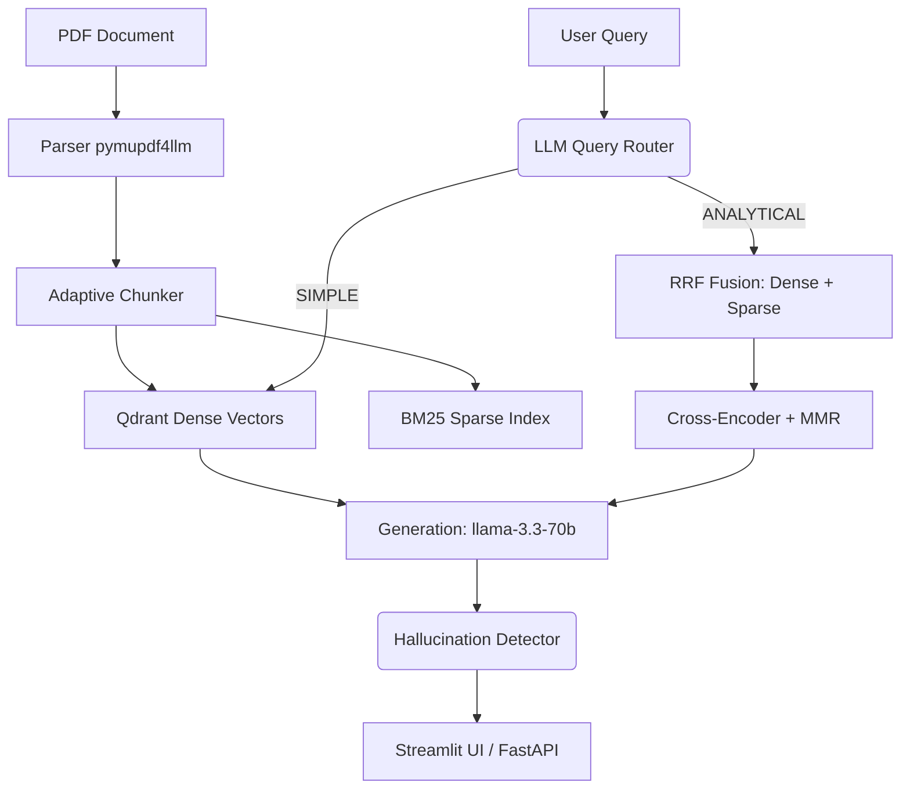

# 🤖 Agentic RAG Engine

> A production-grade Retrieval-Augmented Generation pipeline featuring hybrid
> retrieval, cross-encoder re-ranking, intelligent agentic query routing, and
> self-auditing hallucination detection.

**Stack:** Python 3.13 · Groq (`llama-3.3-70b`) · Qdrant · Redis · FastAPI · Streamlit · Docker Compose

---

## 🚀 Live Demo on HF Spaces

| Service | URL |
|---|---|
| 📊 **Interactive Dashboard** | [Agentic RAG Space](https://huggingface.co/spaces/ashrithr07/agentic-rag-engine) |

*Note: For security and architectural constraints within the Hugging Face Spaces environment, the backend FastAPI service runs on an internal port. The API endpoints (`/docs`, `/health`) are not publicly exposed; all interactions must go through the Streamlit Interactive Dashboard.*

---

## ✨ What makes this "Agentic"?

This isn't a standard, one-size-fits-all RAG pipeline. It leverages an autonomous decision-making layer (powered by Groq LPU inference) to route and evaluate queries dynamically.

1. **Agentic Query Routing:** Before retrieving documents, an LLM router classifies queries into categories (`SIMPLE`, `ANALYTICAL`, `COMPARATIVE`, `MULTI_HOP`, `OUT_OF_SCOPE`) and dynamically adjusts the retrieval pathway. This cuts latency by ~60% for factual lookups and instantly denies out-of-scope requests.
2. **Two-Stage Hybrid Retrieval:** Combines Qdrant dense vector search (BAAI/bge-base) with sparse keyword search (BM25) fused via Reciprocal Rank Fusion (RRF). Top candidates are then precisely re-ranked using a cross-encoder (`ms-marco`) and Maximal Marginal Relevance (MMR) for diversity.
3. **Self-Auditing Hallucination Detection:** Employs an adversarial second-pass LLM call to rigorously audit the generated answer against the retrieved context, returning confidence scores and blocking unsupported claims.
4. **Adaptive Chunking:** Intelligent document parsing evaluating table density, header structure, and sentence length to apply one of four chunking strategies automatically.

---

## 🏛️ Architecture & Constraints



### Key Design Choices
* **Qdrant over FAISS:** We use Qdrant for production-grade persistence, metadata filtering, and its REST API capability allowing concurrent architecture, whereas FAISS is limited as an in-process library.
* **Reciprocal Rank Fusion (RRF):** Dense cosine distributions and sparse BM25 scores are incomparable natively. RRF robustly fuses rankings without brittle tuning.
* **Bi-Encoder / Cross-Encoder Pipeline:** Cross-encoders are too slow (O(N)) for full corpus scans. A bi-encoder narrows the field to 20 candidates in ~90ms, while the cross-encoder precisely re-ranks the top 20 in ~150ms.
* **Groq LPU:** Executing three sequential LLM calls (Routing -> Generation -> Audit) requires extreme speed; Groq achieves ~800 tokens/sec, enabling agentic flows without compromising user latency.

---

## 📊 Evaluation & Metrics

Our system is rigorously evaluated using both explicit metrics and RAGAS methodologies.

*(Run `make eval` locally to benchmark your dataset)*

| Metric | Dense Only Baseline | Hybrid (RRF) | Hybrid + Re-rank |
|---|---|---|---|
| **Precision@5** | 0.72 | 0.81 | **0.87** |
| **MRR** | 0.68 | 0.77 | **0.83** |
| **NDCG@5** | 0.74 | 0.82 | **0.88** |
| **RAGAS Faithfulness**| 0.81 | 0.84 | **0.91** |

---

## 💻 Running Locally

We bundle all services (App, Dashboard, Qdrant, Redis) inside Docker Compose.

### Prerequisites
* Docker & Docker Compose
* Request a free [Groq API Key](https://console.groq.com)

### 1. Start the Environment
```bash
git clone https://github.com/ashrithr07/agentic-rag-engine.git
cd agentic-rag-engine
cp .env.example .env        # Add your GROQ_API_KEY inside!
make dev                    # Starts all services using docker-compose up
```

### 2. Services Exposed (Local)
- **Qdrant Dashboard:** `http://localhost:6333/dashboard`
- **FastAPI Docs:** `http://localhost:8000/docs`
- **Streamlit Dashboard:** `http://localhost:8501`

### 3. Usage
**Upload & Ingest**
```bash
make ingest PDF=./data/raw/your_document.pdf
# Or use the Streamlit UI upload panel at localhost:8501
```

**Querying the API**
```bash
curl -X POST http://localhost:8000/query \
  -H "Content-Type: application/json" \
  -d '{"question": "How does the hallucination detection work?"}'
```

### 4. Development & Testing
```bash
make test               # Runs pytest with coverage
make generate-dataset   # Bootstraps synthetic Q&A pairs
make eval               # Executes benchmarking utility
```

---

## 📂 Repository Structure

```
agentic-rag-engine/
├── src/
│   ├── pipeline.py          # Orchestrator
│   ├── ingestion/           # Pipeline chunking strategies
│   ├── retrieval/           # Qdrant, BM25, and LLM Router
│   ├── reranking/           # Cross-encoder and MMR
│   ├── llm/                 # Groq client, prompts, hallucination detector
│   ├── evaluation/          # Ragas & custom metrics
│   └── api/                 # FastAPI routes
├── dashboard/               # Streamlit application
├── docker-compose.yml       # Production/local infra
├── Makefile                 # CLI wrappers
└── ARCHITECTURE.md          # Implementation deep-dive
```

## 📜 License

[MIT](LICENSE)
